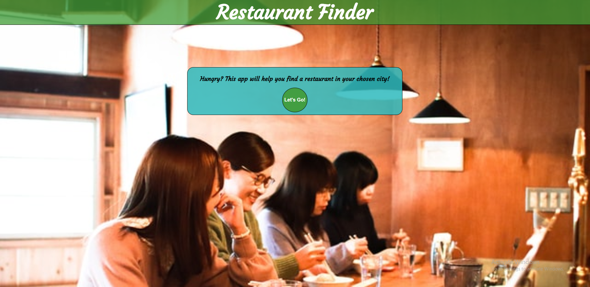
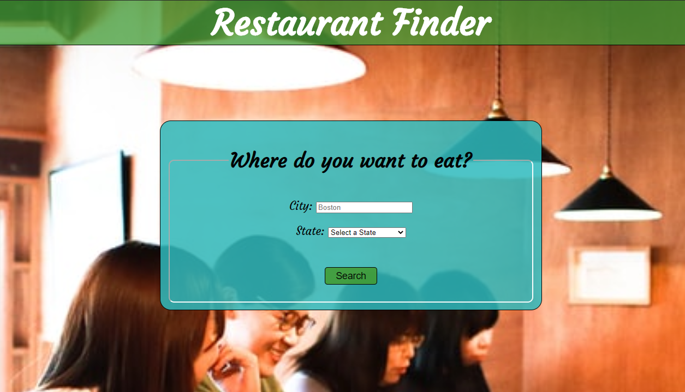
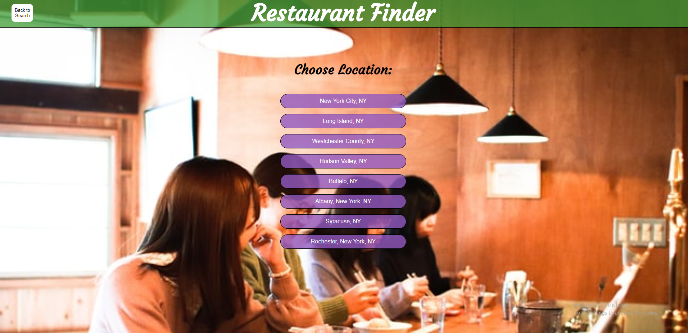
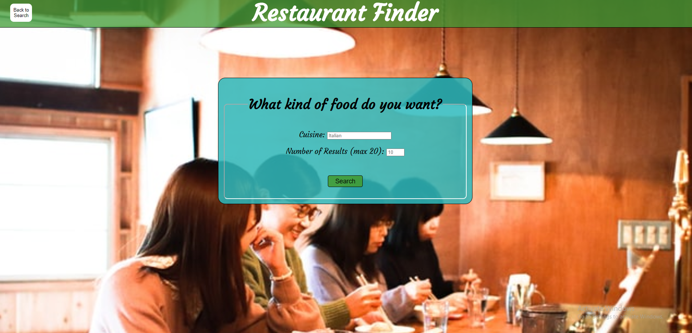
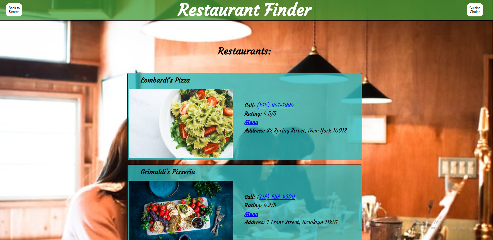

Let's Eat!

This is a relatively simple app which lets the users input the city and cuisine they
would like, and returns a list of results within a 3 mile radius of their cities main street.

link to live app: <a href="https://thinkfulgrandon.github.io/restaurant-finder/">link</a>

The following are images depicting each of the screens a user can expect to come across
as they navigate the app.

stacks used:
    HTML5
    CSS3
    Jquery
